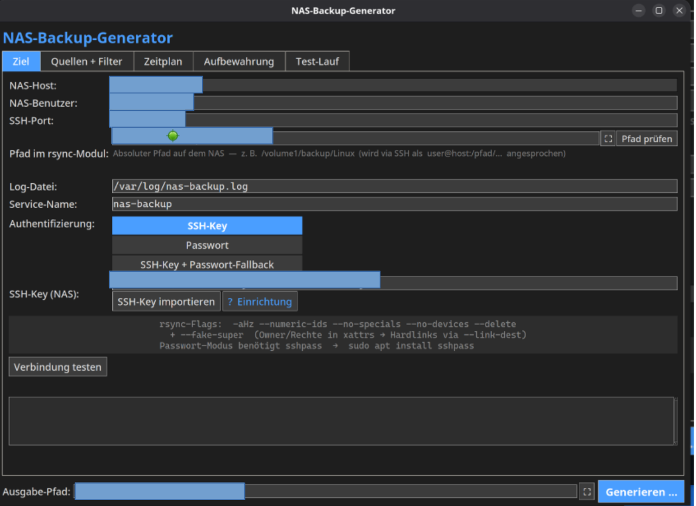

# NAS-Backup-Generator

Ein **Tkinter-GUI-Tool** (Dark-Theme), das fertige Skripte für inkrementelle
**rsync-über-SSH-Backups auf ein NAS** erzeugt – inklusive Restore-Skript,
systemd-Timer und Installer. Reine Python-Standardbibliothek, keine externen
Abhängigkeiten.

> Klicke dich durch die Tabs, fülle deine NAS-Daten ein und lass dir ein
> komplettes, sofort installierbares Backup-Setup generieren.

<!-- Screenshot hier einfügen:

-->

## Features

- **Inkrementelle Snapshots** – pro Lauf ein datierter Ordner (`YYYY-MM-DD/`);
  unveränderte Dateien werden per Hardlink (`--link-dest`) auf den vorherigen
  Snapshot verlinkt → enorme Platzersparnis.
- **non-root-NAS-tauglich** – nutzt `--fake-super`, sodass Owner/Rechte erhalten
  bleiben und Hardlinks trotzdem greifen, auch wenn rsync auf dem NAS als
  normaler Benutzer läuft (siehe unten).
- **Drei Auth-Modi** – SSH-Key, Passwort (via `sshpass`) oder Key mit
  Passwort-Fallback.
- **Frei wählbare Quellen & Ausschlüsse** – beliebige Verzeichnisse und
  rsync-`--exclude`-Muster.
- **Zeitplanung** – generiert `systemd`-`.service`/`.timer` mit `OnCalendar`.
- **Aufbewahrung** – konfigurierbare Anzahl Snapshots; alte werden automatisch
  aufgeräumt. Optionale Sicherung der Paketliste (`dpkg --get-selections`).
- **Verbindungstest & Live-Testlauf** direkt aus der GUI.
- **Restore-Skript** wird mitgeneriert und bei jedem Backup zur
  Disaster-Recovery aufs NAS gespiegelt.

## Voraussetzungen

**Für den Generator:**
- Python 3 mit `tkinter`
- Grafische Umgebung (X11/Wayland)

**Für die generierten Backups (Quell-System):**
- `bash`, `rsync`, `openssh-client`, `systemd`
- `dpkg` (Debian/Ubuntu) für die optionale Paketlisten-Sicherung
- `sshpass` (nur bei Passwort-Authentifizierung)

**Für das NAS:**
- SSH-Zugang; der gewählte SSH-Key muss dort autorisiert sein
- Volume mit **Btrfs oder ext4** (für Hardlinks via `--link-dest` und xattrs für
  `--fake-super`)

## Starten

```bash
python3 nas_backup_generator.py
```

Eingaben werden unter `~/.config/nas-backup-generator/settings.json` gespeichert
(ohne Passwort) und beim nächsten Start wieder geladen.

## Benutzung

1. **Ziel** – NAS-Host, Benutzer, SSH-Port, Authentifizierung und Basis-Pfad
   eintragen; mit „Verbindung testen" / „Pfad prüfen" verifizieren.
2. **Quellen** – zu sichernde Verzeichnisse und Ausschluss-Muster festlegen.
3. **Zeitplan** – Häufigkeit/Uhrzeit für den systemd-Timer wählen.
4. **Aufbewahrung** – maximale Snapshot-Anzahl, optional Paketliste sichern.
5. **Testlauf** – optionaler Probelauf mit Live-Ausgabe.
6. **Generieren** – Ausgabe-Verzeichnis wählen und Skripte erzeugen.

### Generierte Dateien

| Datei | Zweck |
|---|---|
| `<name>.sh` | Das Backup-Skript |
| `<name>.service` / `<name>.timer` | systemd-Units (Zeitplan) |
| `install.sh` | Installiert Skripte nach `/etc/backup/` und aktiviert den Timer |
| `restore.sh` | Interaktives Wiederherstellungs-Skript |
| `INSTALLATION.txt` | Vollständige Anleitung |

### Installieren (auf dem Quell-System)

```bash
cd <ausgabe-verzeichnis>
sudo bash install.sh
```

### Wiederherstellen

```bash
sudo bash /etc/backup/restore.sh --list          # verfügbare Snapshots
sudo bash /etc/backup/restore.sh                 # neuester Snapshot
sudo bash /etc/backup/restore.sh 2025-04-02      # bestimmter Snapshot
sudo bash /etc/backup/restore.sh --dry-run       # Vorschau
```

## Warum `--fake-super`?

Viele NAS-Systeme erzwingen Owner/Rechte (z. B. alles als Login-Benutzer mit
`777`), weil rsync dort als **non-root** läuft. Mit normalem `-a` passen
Owner/Perms dann nie zur Quelle, weshalb `--link-dest` **jede** Datei für
verändert hält → bei jedem Lauf ein Vollbackup statt Hardlinks.

Die generierten Skripte umgehen das mit:

- `--rsync-path="rsync --fake-super"` – Owner/Group/Perms landen in xattrs
  (setzt user-xattr-fähiges Dateisystem voraus, z. B. Btrfs/ext4)
- `--numeric-ids` – numerische uid/gid statt Namensmapping
- `--no-specials --no-devices` – Sockets/FIFOs/Geräte überspringen (auf ihnen
  lassen sich keine xattrs setzen → sonst rsync-Exit-Code 23)

## Entwicklung

```bash
python3 -m py_compile *.py     # Syntax-Check
python3 -m pyflakes *.py       # Linting
```

## Lizenz

MIT – siehe [LICENSE](LICENSE).
